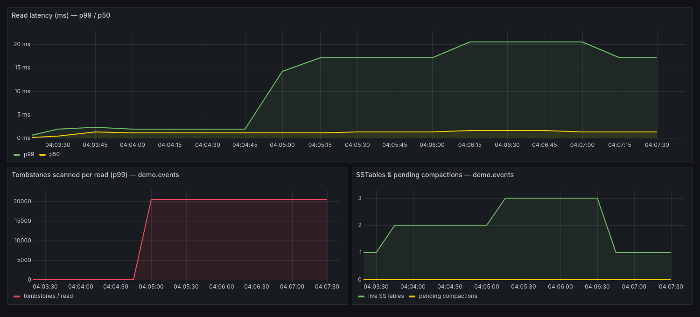
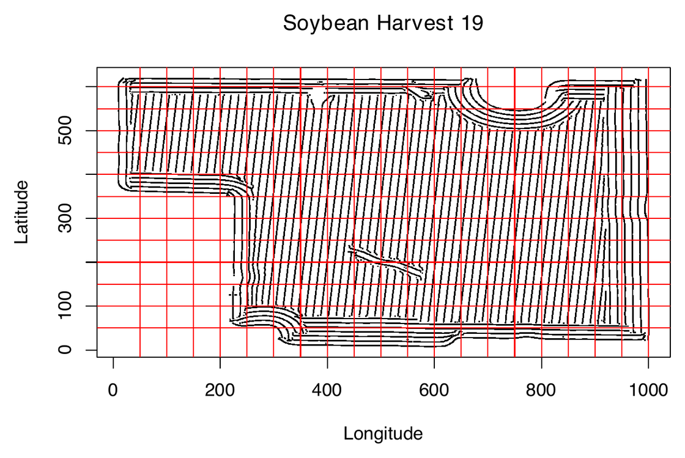
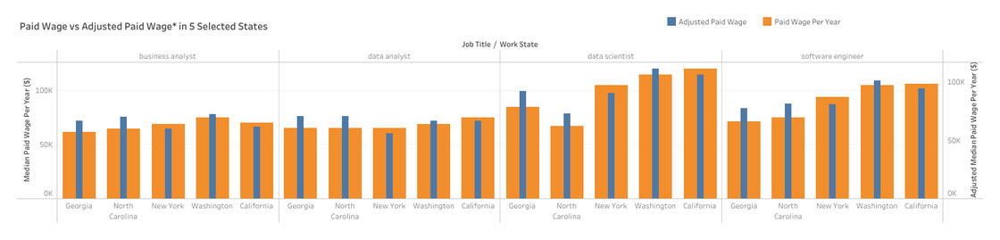
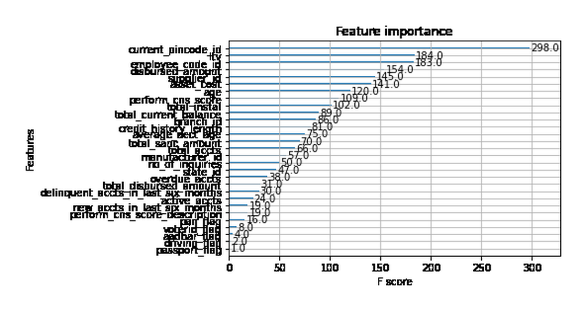
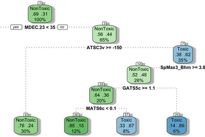
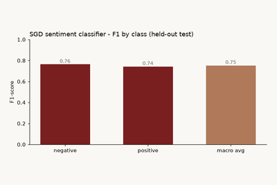
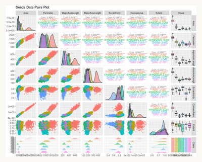
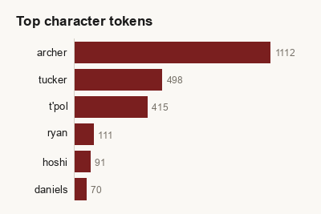
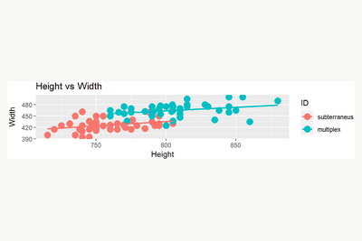

## Bridging data infrastructure and analytics

I keep petabyte-scale storage systems reliable — Cassandra, Redis, S3 on Linux — and turn the data they hold into decisions.
{:.lede}

  
4+ yrsIn production

  
PetabyteCassandra · Redis · S3

  
M.S.Data Analytics

#### Data & Analytics
Python · R · SAS · SQL · pandas · scikit-learn · statistical modeling · machine learning · Tableau

#### Infrastructure & Engineering
Linux · Spark · Hadoop · Hive · Cassandra · Redis · AWS S3 · Ansible · Terraform · shell scripting

---

<nav class="proj-index" markdown="1">
Jump to a project
{:.proj-index-title}

Selected [Distributed-Storage Latency](#latency-diagnosis) · [Precision Agriculture](#precision-agriculture) · [Salary Analysis (Tableau)](#salary-analysis) · [Auto Loan Default](#auto-loan-default)

More [Molecular Toxicity](#toxicity) · [Twitter Sentiment](#twitter-sentiment) · [Seed Analysis](#seed-analysis) · [Star Trek NLP](#star-trek-nlp) · [Vole Skull](#vole-skull)
</nav>

## Selected Work

### Diagnosing Distributed-Storage Latency from Metrics & Logs {#latency-diagnosis}

**A Cassandra read-latency regression traced — from client p99 down to a single log line — to a tombstone buildup, then fixed with compaction.**
{:.proj-headline}

A self-contained, reproducible case study in the infrastructure↔analytics bridge. A single-node Apache Cassandra cluster (Docker) is driven by a Python workload that deliberately injects a production-style fault — mass deletes that leave every read scanning tens of thousands of **tombstones** to return a handful of live rows — while capturing client latency, `nodetool` table/compaction metrics, and the server log. The diagnosis correlates three independent signals — client latency, tombstones-scanned-per-read, and the `tombstone cells` WARN — to localize a "the database is slow" page to one specific storage-engine behavior, then confirms the fix the same way.

**Results:** Reproduced a clean regression — read **p99 jumped ~6× (≈7 → 45 ms), median latency ~4×, and throughput fell ~4× (≈210 → 50 reads/s)** — with each read scanning **~19,800 tombstones to return 100 live rows** (peak ~20,500 per read), confirmed by thousands of `tombstone cells` WARNs in the server log. A major compaction purged the tombstones and returned p99 to its ~7 ms baseline, confirming root cause. The whole incident is visualized live in **Grafana** (Prometheus + JMX exporter) and is fully reproducible from the committed workload script and captured data.

### Precision Agriculture Yield Analysis {#precision-agriculture}

**Seeding rate — not inherent soil quality — is the dominant driver of field yield.**
{:.proj-headline}

A spatial causal analysis of four years (2017–2020) of GPS yield-monitor data from corn and soybean fields, asking a concrete agronomic question: when a region of the field yields poorly, is it due to a lower seeding rate or just inherently poor ground? Hundreds of thousands of geotagged harvest and seeding points across six datasets were binned into a 50×50 coordinate grid, sparse cells (<30 observations) were filtered out, and per-cell mean **Yield** and **Applied Seeding Rate** were aggregated and merged across years. **Bayesian network structure modeling** (`bnlearn`) with arc-strength scoring was then used to compare the causal influence of prior-year yield versus applied seeding rate on subsequent-year yield — repeated on rank-normalized data to suppress edge-of-field outliers.

**Results:** Across both raw and rank-normalized networks, **applied seeding rate showed strong arc strength to subsequent yield, while year-over-year yield→yield links were consistently weak** — evidence that seeding rate, not inherent field quality, is the dominant driver of yield. Outliers localized to field edges (poorer soil / crop establishment), and the one weak seeding→yield year (2018) was attributed to unmeasured factors like precipitation or wildlife.

### Salary Analysis of Data-Related Jobs (Tableau) {#salary-analysis}

**A cost-of-living adjustment reorders the "best-paying" states away from the obvious coastal hubs.**
{:.proj-headline}

A seven-view interactive Tableau dashboard examining compensation for four data-related roles — business analyst, data analyst, data scientist, and software engineer — among **27,741** Green Card and H1B visa filings (2008–2015, U.S. Office of Foreign Labor Certification data). Views progress from headline trends (median paid wage per year by job title and visa class) into compliance and fairness analysis: difference between paid and *prevailing* wage, paid wage adjusted for state cost-of-living, and top states and companies by adjusted pay — all linked by interactive filters for self-service exploration.

**Results:** Surfaced a **cost-of-living-adjusted** view that reorders the "best-paying" states away from the obvious coastal hubs, and flagged specific large employers (e.g. IBM, Google, LinkedIn) that paid below the prevailing wage at least five times — turning a raw salary table into an interpretable equity narrative.

### Auto Loan Default Prediction {#auto-loan-default}

**XGBoost held 78% accuracy down to 2 of 30 features — cutting model-serving cost with no accuracy loss.**
{:.proj-headline}

The following is for a team-based approach to an auto loan default prediction algorithm. Various techniques were used for data exploration, feature extraction, and model selection. The data contained roughly 40+ features as well as incomplete data for some columns. Normalization was performed on several features and models such as XGBoost and Support Vector Machines were compared for performance by using an 80/20, Train/Test split.

**Results:** Final XGBoost model reached **78.3% test accuracy** (AUC ≈ 0.66) on a heavily imbalanced target. Feature-importance thresholding showed accuracy held within 0.1% even when reducing from 30 to 2 features — useful for downstream model-serving cost.

#### Data Preprocessing:

#### Exploratory Data Analysis:

#### XGBoost Initial Testing:

## More Projects

### Molecular Toxicity Classification {#toxicity}

A binary classification of 171 chemical compounds (toxic vs. non-toxic) using molecular descriptors from the UCI toxicity-2 dataset. The full feature set contains 1,203 descriptors — Recursive Feature Elimination (RFE) with a random-forest backbone was used to reduce dimensionality before fitting Decision Tree and Random Forest models under leave-one-out cross-validation.

**Results:** RFE reduced **1,203 features to 8** without loss of cross-validated accuracy. Random Forest reached **68% test accuracy** (Kappa = 0.22) on a 2:1 imbalanced target — a 7-point absolute improvement in error over the single-tree baseline (61%). The dimensionality reduction is the headline result: comparable predictive performance from <1% of the original feature space.

### Twitter Sentiment Analysis {#twitter-sentiment}

A comprehensive analysis of 5,000 twitter posts that includes preprocessing, tokenization, feature reduction and classification using Stochastic Gradient Descent. Accuracy was measured using KFold Cross-Validation.

**Results:** SGD classifier reached **average F1 = 0.77** across 10 folds after feature reduction (up from 0.69 on the raw pipeline), with per-fold accuracy ranging 78–84%.

### Seed Analysis {#seed-analysis}

A team-based approach to provide an accurate classification algorithm for mixed populations of dry bean seeds in central Asian countries. A comprehensive feature analysis was performed to provide the most beneficial features to be used in classification models. Multiple models were utilized for this project and accuracy was determined by determining the fiscal value of a subset from the data supplied.

**Results:** Cost-weighted polynomial LDA model selected after 10-fold CV. Predicted per-pound seed valuations for three unlabeled samples ($4.59 / $3.35 / $3.34), prioritizing dollar-impact over raw classification accuracy.

### Star Trek NLP — Preprocessing and Frequency Analysis {#star-trek-nlp}

An exploratory NLP pipeline on dialogue from *Star Trek: Enterprise* scripts. Built a reusable text-normalization pipeline (punctuation, URL, HTML, contraction, and number-to-word handling), then ran a side-by-side comparison of **WordNet lemmatization** versus **Lancaster stemming** on the same tokenized corpus, followed by a per-episode frequency distribution.

**Results:** Composed an 8-stage normalization pipeline reusable across NLP tasks. Lemmatization preserved interpretable dictionary forms; Lancaster stemming collapsed vocabulary aggressively but produced non-word artifacts (`hundr`, `fiftyon`) — a concrete demonstration of the readability/compression tradeoff. Frequency analysis surfaced principal-cast character names as the dominant per-episode tokens, matching the show's narrative structure.

### Vole Skull Classification {#vole-skull}

A statistical comparative analysis of Vole species using various morphological measurements of Vole skulls from a sample of 89 specimens. Multiple classification models were compared to predict 199 unclassified vole skulls using cross validation to determine the final accuracy.

**Results:** Final GLM achieved **91% accuracy** (Kappa = 0.83) under 10-fold CV. Classified 117 of 199 unknowns as *multiplex* and 82 as *subterraneus*.

